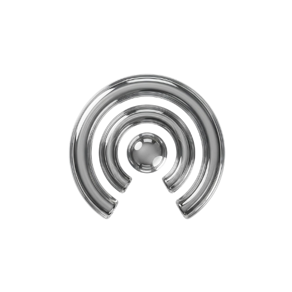
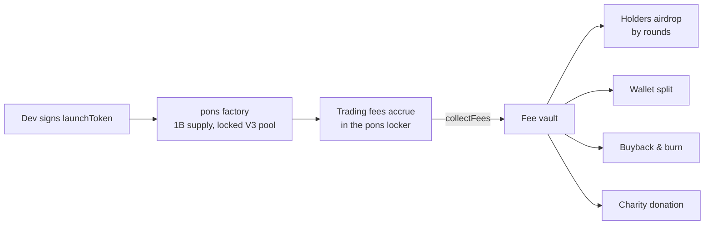

<div align="center">



# PonsDrop

**Launch tokens on Robinhood Chain. Route the creator fees anywhere.**

Deploy through the [pons](https://ponsfamily.com) factory from your own wallet,
then point the 70% creator fee stream wherever you want: your holders, your team,
a burn, or a charity. Set once at launch, runs itself.

[](LICENSE)
[](https://robinhoodchain.blockscout.com)
[](package.json)

`Express` · `viem` · `no build step` · `Uniswap V3` · `pons factory`

</div>

---

## Fee modes

Every pons token pays its creator 70% of all trading fees on its locked pool, forever.
PonsDrop adds one decision to the launch form: who eats?

| Mode | What happens |
| --- | --- |
| **Keep it** | Fees go to your wallet. Identical to launching on pons directly. |
| **Drop to holders** | Fees pool in a vault and rain on holders `#N` to `#M` (up to `#1000`) in up to 30 rounds. Rounds trigger on a market cap ladder (`×2` / `+$X`) or a timer. |
| **Split fees** | Up to 20 wallets by percent, paid out automatically. |
| **Buyback & burn** | Fees market-buy the token on its own pool and send it to `0x...dEaD`. |
| **Donate to charity** | Fees are converted to ETH and donated on-chain. Built-in verified addresses (Internet Archive, EFF, Freedom of the Press Foundation) or any address you provide. |

## How it works



- **Launching is non-custodial.** Your wallet signs `launchToken()` on the factory; the launch fee and dev buy go to the factory, never to PonsDrop.
- **Managed fee modes use a vault.** A fresh wallet is generated per launch and set as the on-chain `feeWallet`. Its key is stored AES-256-GCM encrypted; the encryption key lives only in server env vars. Only creator fees ever touch it.
- **Everything is auditable.** Every payout is a plain transfer from the vault, visible on [Blockscout](https://robinhoodchain.blockscout.com) and listed on the token page.

Full docs live at `/docs` on the site: launch guide, fee mode details, trust model, contracts, HTTP API.

## Pages

| Route | What |
| --- | --- |
| `/` | Landing with a quick-start launch card |
| `/launch` | Full launch form: token, image upload (1:1), fee routing |
| `/explore` | Tokens launched through PonsDrop, live price / cap / graduation |
| `/token/<address>` | Vault balance, drop schedule, payout history |
| `/docs` | Documentation (docsify) |
| `/admin` | Pause, force a round, inspect state (token-gated) |

## Network

| | |
| --- | --- |
| Chain | Robinhood Chain (4663) |
| Factory | `0xA5aAb3F0c6EeadF30Ef1D3Eb997108E976351feB` |
| Locker | `0x736D76699C26D0d966744cAe304C000d471f7F35` |
| Launch fee | 0.0005 ETH · supply 1B fixed · graduation 4.2 ETH |
| Creator fees | 70% of the pool's 1% trading fee |

## Quick start

```bash
git clone https://github.com/amberaiagent/ponsdrop.git
cd ponsdrop
cp .env.example .env
# generate the vault key: openssl rand -base64 32 -> VAULT_ENCRYPTION_KEY
# set a long random ADMIN_TOKEN
npm install
npm start        # web + indexer on http://localhost:3000
npm run bot      # distribution bot (DRY_RUN=true by default)
```

Docker: `docker compose up -d` runs web and bot with `./data` mounted.

**Going live:** prove a launch end-to-end with `DRY_RUN=true`, then flip it to `false`.
Back up `data/`: it holds the encrypted vault keys. Never commit `.env`.

## Disclaimer

PonsDrop is an unofficial layer on pons and is not affiliated with Pons Labs or
Robinhood. Tokens are volatile; transactions may be irreversible. Nothing here
is financial advice.
